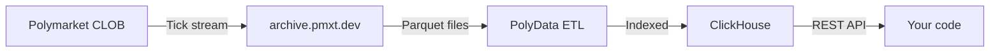

# Welcome to PolyData

**PolyData** provides historical Polymarket orderbook data at tick-level precision. Every order placed, every cancellation, every price change — captured and queryable through a clean REST API.

<CardGroup cols={2}>
  <Card title="Quickstart" icon="rocket" href="/quickstart">
    Make your first API call in 30 seconds.
  </Card>
  <Card title="API Reference" icon="terminal" href="/api-reference/orderbook">
    Full endpoint documentation.
  </Card>
  <Card title="Pricing" icon="credit-card" href="/pricing">
    Transparent pricing. Pay with crypto.
  </Card>
  <Card title="Backtesting Guide" icon="chart-line" href="/guides/backtesting">
    Build a backtest with PolyData.
  </Card>
</CardGroup>

## What you get

<AccordionGroup>
  <Accordion title="Tick-level L2 orderbook" icon="layer-group">
    Every orderbook change captured at millisecond precision. Full bid/ask depth at every level — not just top-of-book.
  </Accordion>
  <Accordion title="OHLCV candles" icon="chart-column">
    Pre-aggregated candles at 1m, 5m, 15m, 1h, 4h, and 1d resolutions. Includes tick-count volume.
  </Accordion>
  <Accordion title="Bulk export" icon="download">
    Stream entire date ranges as CSV or JSONL. Pipe directly into pandas, Polars, or your backtester.
  </Accordion>
  <Accordion title="Slippage simulation" icon="arrows-up-down">
    Walk historical orderbooks to compute exact fill prices for any order size. No more guessing on size impact.
  </Accordion>
</AccordionGroup>

## Data scale

<CardGroup cols={4}>
  <Card title="27B+" icon="database">
    Orderbook ticks indexed
  </Card>
  <Card title="60K+" icon="hashtag">
    Outcome tokens
  </Card>
  <Card title="3 mo" icon="calendar">
    Historical depth
  </Card>
  <Card title="<100ms" icon="bolt">
    Avg query latency
  </Card>
</CardGroup>

## Use cases

- **Backtesting** — Replay tick-by-tick orderbooks to validate trading strategies before going live.
- **Research** — Analyze market microstructure, liquidity, cross-market correlations.
- **ML feature engineering** — Train models on clean, structured tick streams.
- **Risk modeling** — Understand realistic slippage for any position size.

## How it works

1. We index the public Polymarket orderbook archive into ClickHouse.
2. You query via REST API with sub-100ms latency.
3. Pay only for what you need — daily lookups or full unlimited access.

<Card title="Get started" icon="play" href="/quickstart">
  Register for an API key and run your first query in under a minute.
</Card>
